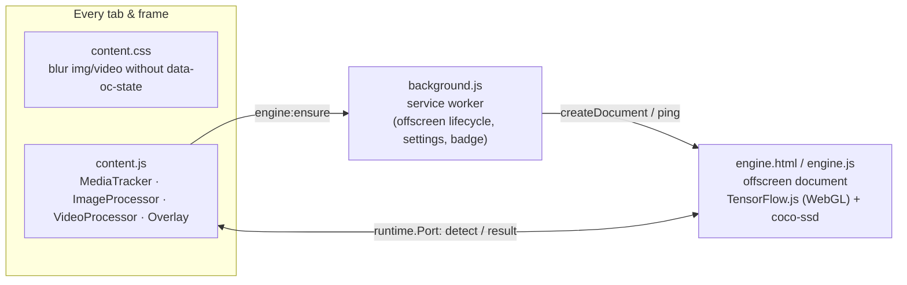

# Object Censor

A Manifest V3 browser extension (Chrome / Edge / other Chromium browsers ≥ 116) that runs an
object detector **locally in the browser** and censors what it finds:

- Every `` and `<video>` is **blurred the moment it appears** (stylesheet injected at
  `document_start`), before any pixel of it is shown.
- Each piece of media is analysed with [coco-ssd](https://github.com/tensorflow/tfjs-models/tree/master/coco-ssd)
  (`lite_mobilenet_v2`) running on [TensorFlow.js](https://www.tensorflow.org/js). Media without
  hits is un-blurred; media with hits is un-blurred and the detected objects are covered with
  **black boxes that track the element** through scrolling, resizing, `object-fit`, clipping
  containers and fullscreen.
- Five COCO classes are censored: **person, dog, cat, knife, bottle** (each can be toggled in
  the options).
- Videos are analysed **frame by frame** (`requestVideoFrameCallback`) while they play; boxes
  from the last few results are merged and a video is re-blurred if results stop arriving.
- When an image's source changes (`src`, `srcset`, `<picture>` sources, lazy loading) it is
  re-blurred and re-analysed; stale boxes never cover new content.
- Works on any site: dynamically inserted media, open **and closed shadow roots**, all frames,
  cross-origin images, `<picture>`, video posters, MSE/`blob:` video.

Nothing leaves the machine – there is no server component.

## How it works



1. **Blur first.** The manifest injects `content.css` at `document_start` in every frame. It blurs
   `img:not([data-oc-state])` and `video:not([data-oc-state])`. The content script injects the
   same rules into every shadow root it discovers.
2. **Track media.** `MediaTracker` walks the DOM (including shadow roots via
   `chrome.dom.openOrClosedShadowRoot`), observes mutations, source attribute changes, `load` /
   media events, element resizes and viewport proximity (`IntersectionObserver`, 50 % margin).
3. **Analyse.** Media near the viewport is captured into a small WebP data URL (same-origin /
   CORS-clean pixels) or its URL is handed over (cross-origin images) and sent through a
   `runtime.Port` to the **engine** – a single offscreen document shared by all tabs, so the
   ~18 MB model is loaded once. The engine downscales, runs coco-ssd and returns boxes.
4. **Apply.** The content script filters detections by the configured classes/threshold, sets
   `data-oc-state` (`clean`, `censored`, `skipped`, `failed`) which lifts the blur, and hands
   normalised boxes to the `Overlay` – one fixed-position host (`<object-censor-overlay>`) with a
   shadow root whose box positions are re-synced every animation frame while visible.
5. **Videos.** While a video plays, one frame at a time is in flight; results are merged over
   600 ms for stable coverage, and if no result arrives for 2 s the video is blurred again. Posters
   are analysed like images. Cross-origin video without CORS is reloaded once with
   `crossorigin="anonymous"` (a declarativeNetRequest rule adds `Access-Control-Allow-Origin: *`
   to media responses); DRM (EME) video cannot be read.
6. **Fail closed.** Media that cannot be analysed (`failed`) stays blurred by default; this is a
   setting. If the extension is reloaded, orphaned content scripts release the page.

## Getting started

```bash
npm install
npm run build          # downloads the model into public/model (once) and builds dist/
```

Then in Chrome/Edge: open the extensions page, enable **Developer mode**, choose
**Load unpacked** and select the `dist` folder. Click the toolbar icon to toggle censoring globally
or for the current site, and open **Settings** for classes, confidence threshold, blur strength,
the policy for unanalysable media and the list of disabled sites.

### Scripts

| Command               | Purpose                                                              |
| --------------------- | -------------------------------------------------------------------- |
| `npm run build`       | Production build to `dist/` (runs `fetch-model` first)               |
| `npm run build:dev`   | Development build with inline source maps                            |
| `npm run watch`       | Rebuild on change                                                    |
| `npm run typecheck`   | `tsc --noEmit`                                                       |
| `npm run fetch-model` | Download the coco-ssd graph model into `public/model/` (git-ignored) |
| `npm run icons`       | Regenerate the toolbar icons                                         |
| `npm test`            | Content-script and engine test suites in headless Chrome (see below) |
| `npm run test:e2e`    | Full extension smoke test (needs a Chromium build, see below)        |

### Tests

- `npm run test:content` runs the built content script in a plain page with `chrome.*` mocked and a
  fake engine, checking blur-by-default, state attributes, box geometry, clipping, shadow DOM,
  source changes, the video frame loop, settings changes and extension-reload handling.
- `npm run test:engine` runs the real engine bundle (TensorFlow.js + the bundled model) in headless
  Chrome and verifies detections on a cat photo through both source kinds and the error codes.
- `npm run test:e2e` loads the actual extension. Google Chrome 137+ no longer honours
  `--load-extension`, so this needs a Chromium build: run `npx playwright-core install chromium`
  once, or point `CHROMIUM_PATH` at a Chromium / Chrome for Testing binary.

All suites use the locally installed browser through `playwright-core`; the fixture photo is
downloaded from Wikimedia Commons on first use into `tests/.artifacts/`.

## Project structure

```
public/
  manifest.json        MV3 manifest
  content.css          blur-by-default rules injected at document_start
  rules.json           declarativeNetRequest rule (CORS header on media responses)
  engine.html          offscreen document hosting the model
  popup.html / options.html / ui.css
  icons/               generated by scripts/generate-icons.mjs
  model/               coco-ssd weights (downloaded, git-ignored)
src/
  background.ts        service worker: offscreen lifecycle, settings, badge
  engine/engine.ts     inference engine (TensorFlow.js + coco-ssd), request queue
  content/
    index.ts           bootstrap, settings → start/stop, shadow-root styles
    media-tracker.ts   DOM discovery & observation (mutations, shadow roots, IO, RO, events)
    image-processor.ts image state machine (capture → detect → boxes / state)
    video-processor.ts video frame loop, posters, staleness, CORS reload
    overlay.ts         fixed overlay host + per-media box groups, per-frame geometry sync
    geometry.ts        object-fit / object-position / clipping maths
    capture.ts         canvas capture & encoding, taint detection
    engine-client.ts   port to the engine: requests, timeouts, reconnection, backoff
    media-state.ts     data-oc-state helpers, filtering, source classification
    settings-store.ts  live settings for this frame (hostname / ancestor checks)
  shared/              settings schema, message protocol, censored classes, logging
  popup/, options/     toolbar popup and options page
scripts/               fetch-model.mjs, generate-icons.mjs
tests/                 harness (content, engine), e2e, shared helpers
```

## Permissions

| Permission                     | Why                                                                                   |
| ------------------------------ | ------------------------------------------------------------------------------------- |
| `host_permissions: <all_urls>` | Content scripts on every site; the engine fetches cross-origin images itself.         |
| `offscreen`                    | Hosts the model in one hidden document shared by all tabs.                            |
| `storage`                      | Settings (`chrome.storage.sync`).                                                     |
| `declarativeNetRequest`        | Adds `Access-Control-Allow-Origin: *` to media responses so video frames can be read. |
| `activeTab`                    | Lets the popup show/toggle the current site.                                          |

## Limitations

- CSS `background-image`, `<canvas>`/WebGL-rendered media and SVG `<image>` are not analysed.
- Animated images (GIF/APNG/WebP) are analysed once, on the frame that is current at capture time.
- DRM-protected video, and cross-origin video whose server rejects anonymous CORS requests, cannot
  be read; they follow the “media that cannot be analysed” policy (blurred by default).
- Picture-in-Picture windows render the raw video; fullscreen `<video>` elements cannot be
  overlaid and are blurred entirely while they contain detections.
- Detection quality is that of `lite_mobilenet_v2` coco-ssd (fast, modest accuracy); the
  confidence threshold is configurable.
- Chromium-only (`chrome.offscreen`); Firefox would need the engine hosted in a background page.
